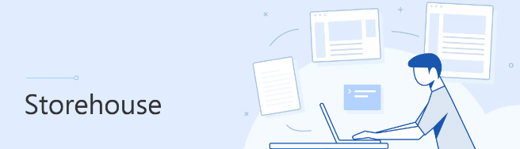

|")|
| :---: |
|Virtualize Brief on :tv: Youtube. Deploying Storehouse step-by-step|

---
Documentation website using markdown files. This simple deployment for a windows machine takes you from nothing to up and running in a minute or two.

Having also completed this on linux machines and git repositories it is still most common in the IT world for others to gravitate towards windows machines. Thus we seek to meet people where they are.

# Retype
Work engine for producing Storehouse. Information on creating pages, components, images, video and more found here: [retype components](https://retype.com/components/).

# Deploy :hammer:
Login windows machine and run: [deploy-retype-storehouse.ps1](deploy-retype-storehouse.ps1)

|Feature|Name|Note|
|:---|:---|:---|
|Logo|[icon-storehouse.png](images/icon-storehouse.png)|Copy file to: c:\support\storehouse\site\files|
|Scheduled task|Start Storehouse|Edit Start Storehouse selecting a user or service account that has admin privileges on the machine.|
|Storage|c:\support\storehouse\site|Where to put documents, etc.|
|Wesbite URL|http://localhost:5000 |Should put a cert and configure friendly url in dns.|

# Resources
- :blue_book: [Markdown getting started](https://www.markdownguide.org/getting-started/)
- :closed_book: [Retype components](https://retype.com/components/)
